## Integrantes

- name: Arias Quispe Jhonatan David

- name: Chambilla Perca Ricardo Mauricio

- name: Carbajal Gonzales Diego Alejandro

**URL a los repositorios:**

- Frontend: <https://github.com/JhonatanDczel/coder-dojo-front>

- Backend: <https://github.com/rikich3/coderDojoBack>

# Coder Dojo y la IEEE CS Unsa

Aplicación para el evento de Coder Dojo que está organizando la **_IEEE Computational Society rama Perú_** por parte de la **_UNSA_**.

## Requerimientos

Las especificaciones que recibimos de los coordinadores fueron:

1. **Tipos de Usuario**:

   - **Profesor**: Puede crear salones virtuales y asignar tareas a los estudiantes.
   - **Estudiante**: Puede unirse a los salones y acceder a las tareas asignadas.
   - **Administrador**: Gestiona la plataforma.

2. **Salones Virtuales**:

   - Los profesores pueden crear salones y asignar tareas a los estudiantes dentro de esos salones.
   - Los salones contienen a estudiantes y un profesor.
   - Los profesores pueden publicar material de estudio y otros recursos que los estudiantes pueden ver.

3. **Usuarios Objetivo**:
   - Estudiantes de secundaria.
   - La plataforma debe incluir elementos de gamificación para aumentar la atención y el compromiso.
   - Utiliza un framework moderno desarrollado por Octolasys Group para mejorar la experiencia del usuario.

## Planificación

Una vez tecibidas las especificaciones, procedimos a crear los mockups en una herramienta de diseño: `excalidraw`.

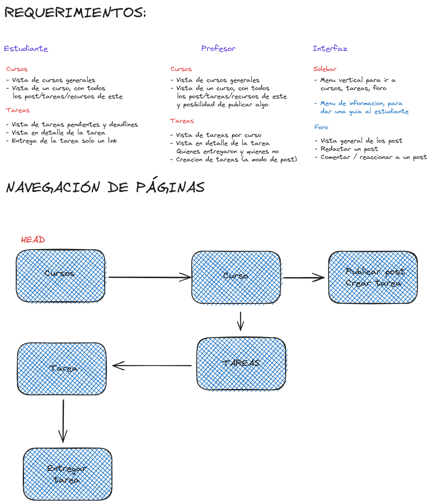

## Desarrollo

Una vez entendida la dinámica de la interacción entre las páginas, se procede con el desarrollo, que está dividido en dos partes: `frontend` y `backend`.

### Stack de desarrollo

Las tecnologías que se eligieron para el proyecto, fueron:

- **Django**: Para el lado del backend.
- **Django REST Framework**: Usado para hacer las API que consumira el frontend.
- **React**: Para crear las vistas y aprovechar el aspecto reactivo de react.
- **Tailwind**: Para manejar los estilos de una mejor manera a css puro.

## Frontend

Para el desarrollo del lado del frontend, se dividió en las siguientes tasks:

- **Login** - que debería tener la autenticación de los usuarios, así como el minigame `DojoType`.
- **Dashboard** - que debería tener el acceso a las vistas como los cursos, vista por curso, y las tareas que se tienen.

### Login

El login se hizo en `react` con un diseño basado en componentes, se enfatizó el concepto de `gamificación` de la interfaz para hacerla más amigable para nuestro público objetivo (estudiantes de secundaria).

### Dark - Light - System modes

Con ese objetivo en mente, se optó por una interfaz sencilla, clara y concisa, que destaque los elementos importantes y que tenga un toque fresco, esta es una vista de la interfaz:

**_Modo dark_**

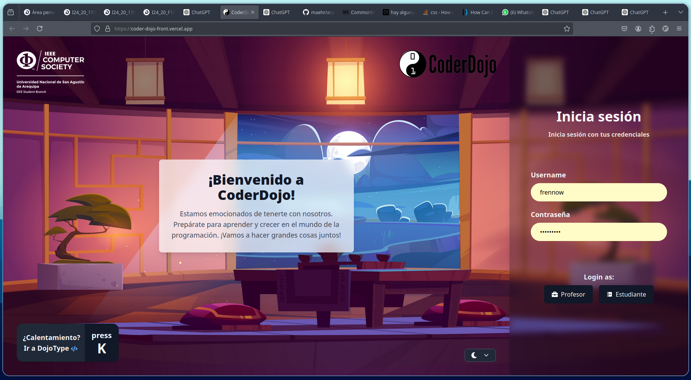

**_Modo light_**

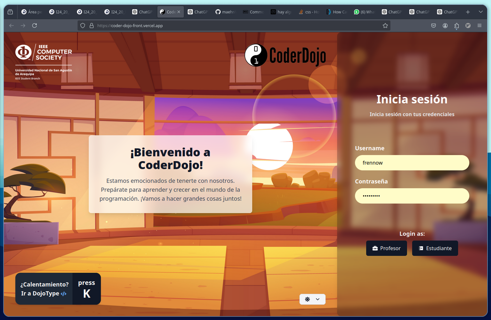

Para poder hace rel cambio entre modos dark, light o system se usó el siguiente componente:

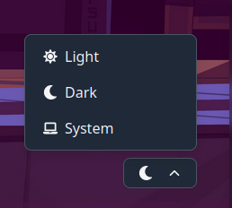

que es un componente de react:

```js
// src/components/common/ThemeSwitcher.js
const ThemeSwitcher = () => {
  const [theme, setTheme] = useState("system");
  const [isOpen, setIsOpen] = useState(false);

  useEffect(() => {
    const root = window.document.documentElement;
    if (theme === "dark") {
      root.classList.add("dark");
      localStorage.setItem("theme", "dark");
    } else if (theme === "light") {
      root.classList.remove("dark");
      localStorage.setItem("theme", "light");
    } else {
      root.classList.remove("dark");
      if (window.matchMedia("(prefers-color-scheme: dark)").matches) {
        root.classList.add("dark");
      }
      localStorage.removeItem("theme");
    }
  }, [theme]);

  const handleThemeChange = (newTheme) => {
    setTheme(newTheme);
    setIsOpen(false); // Close the dropdown after selection
  };

```

### DojoType

Junto al concepto de gamificación viene esta idea: hacer un centro de entrenamiento previo, en el que los alumnos puedan ejercitar sus habilidades de tipeo antes de hacer las lecciones de CodeDojo.

Para esto, hicimos DojoType!, que es un minigame a modo de test de mecanografia que mide tu velocidad y la guarda para mantener un record que romper.

El diseño inicial pensado fue este:

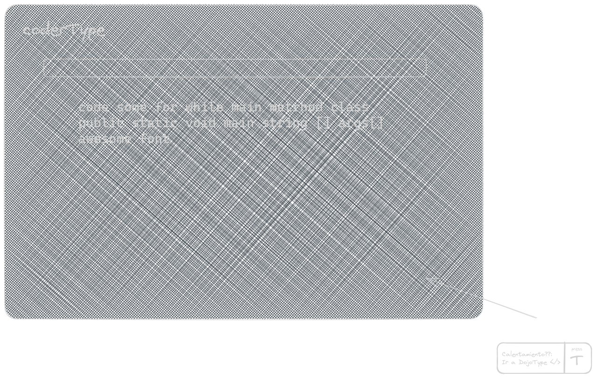

Para su implementación, y en pos de la modularización de código, se hizo un nuevo componente, que llamamos dentro de un PopUp (también componente) que contendrá el juego, esto nos permite, por ejemplo, escalar el minigame si asi lo queremos hasta convertirlo en un proyecto independiente, la vista final fue esta:

**_DojoType_**

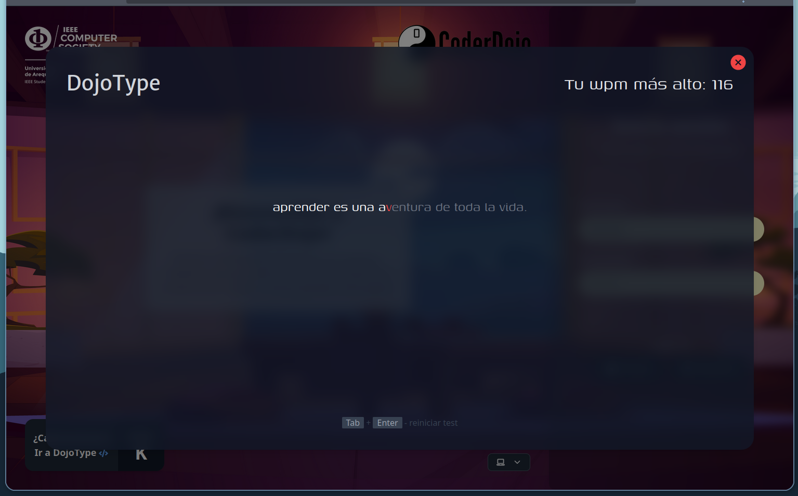

**_Visualización de los datos del test_**

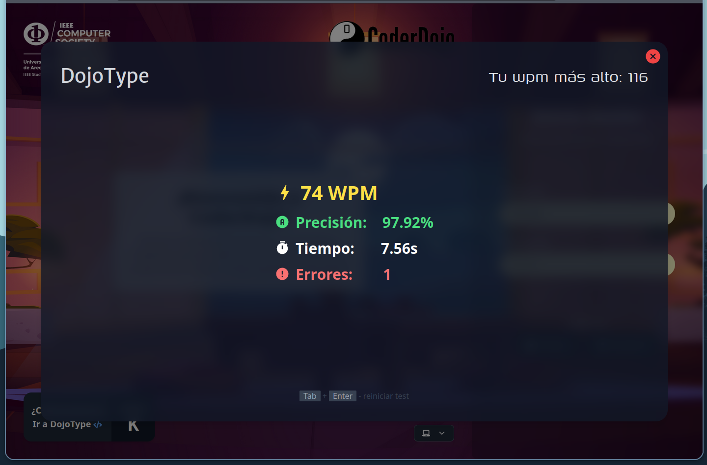

### Composición de la interfaz

La interfaz esta conmpuesta siguiendo reglas de código limpio y buenas prácticas de programación, a continuación tenemos el codigo del componente `HomePage` que se encarga del renderizado de la página principal:

```js
//src/pages/HomePage.jsx
        <div className="...">
          <div className="...">
            <div className="...">
              <h1 className="...">
                ¡Bienvenido a CoderDojo!
              </h1>
              <p className="text-lg text-gray-700">
                Estamos emocionados de tenerte con nosotros. Prepárate para
                aprender y crecer en el mundo de la programación. ¡Vamos a hacer
                grandes cosas juntos!
              </p>
            </div>
          </div>
          <div className="absolute top-5 left-5 p-4">
            <Logo path={IEEELogo} size="h-28"/>
          </div>
          <a href="https://coderdojo.com/en/" target="_blank" className="inset-1">
            <div className="absolute top-5 right-5 p-4">
              <Logo path={coderDojoLogo} size={"h-[4.5rem]"}/>
            </div>
          </a>
          <div className="absolute bottom-5 left-5 p-4">
            <DojoTypeButton onClick={handleDojoTypeButtonClick} />
          </div>
          <div className="absolute bottom-5 right-5 p-4">
            <ThemeSwitcher />
          </div>
        </div>
      </div>
      <LoginForm />
```

### Vistas de los cursos

Las vistas de cursos y de cada curso individual una vez que el usuario se autentifica son las siguientes:

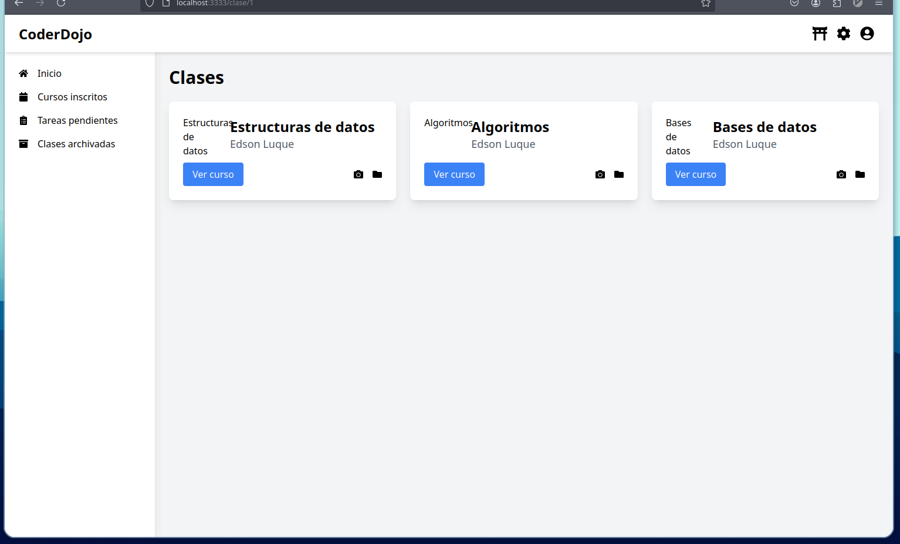

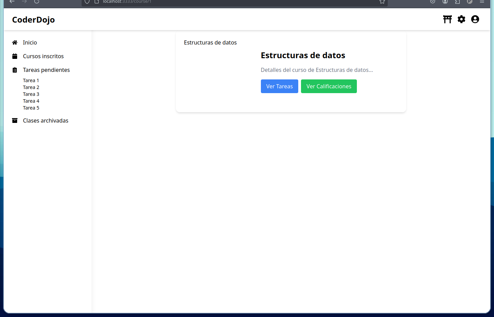

Para los cursos se hacen peticiones al backend, que devuelven una lista de cursos en los que el docente/estudiante forma parte, todos estos datos se usan para dibujar la interfaz en el front:

```json
[
  {
    "id": 1,
    "docente": {
      "id": 1,
      "name": "Ricardo"
    },
    "name": "Frameworks Web",
    "entregas": [
      {
        "id": 1,
        "file": "/entregas/GITHUB.txt",
        "submitted_at": "2024-07-24T08:41:23.819654Z",
        "estudiante": {
          "id": 1,
          "name": "pepe"
        },
        "asignacion": {
          "id": 1,
          "title": "Generar paginas con Javascript",
          "description": "Manipulando el dom con javascript"
        }
      }
    ],
    "publicaciones": [
      {
        "id": 1,
        "content": "Ejemplo de publicacion para alumnos"
      }
    ],
    "estudiantes": [
      {
        "id": 1,
        "name": "pepe"
      },
      {
        "id": 2,
        "name": "Raquel"
      }
    ]
  }
]
```

### Verificación de inicio de sesión

Para evitar que cualquier persona intente entrar con el link directo, se desarrolló un sistema de verificación, que hace un llamado a la API para ver si una `sessionId` esta autenticada o no.

La llamada a la API nos da algo como esto:

```json
// el endpoint es /api/is_authenticated
HTTP 200 OK
Allow: GET, OPTIONS
Content-Type: application/json
Vary: Accept

{
  "authenticated": true
}
```

En caso de no estar autenticado el usuario, se muestra un `PopUp` y un mensaje emergente invitándolo a registrarse:

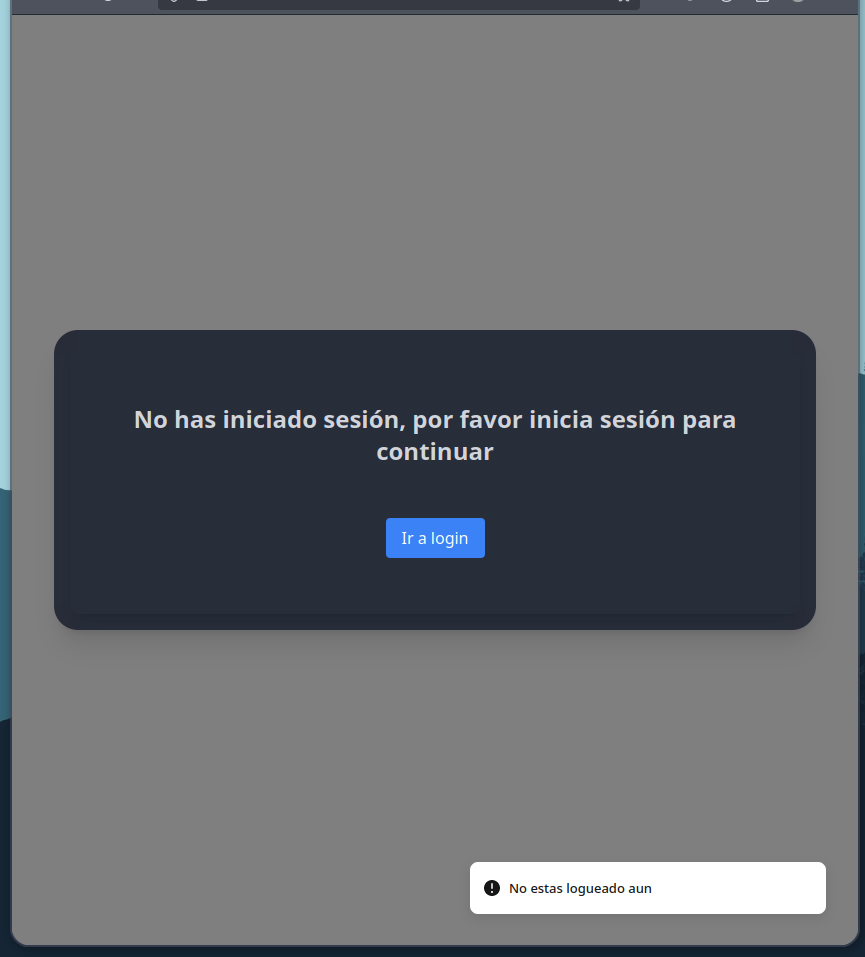

###

**Composicion**:

La composición para estas vistas fué la siguiente:

```js
return (
  <div className="flex">
    <Sidebar />
    <div className="ml-64 w-full">
      <Navbar data={data} />
      <div className="pt-16">
        <StudentRoutes />
      </div>
      <CoursesList />
    </div>
  </div>
);
```

Para el ruteo de la web se usó la biblioteca `react-router-dom`, la estructura es la siguiente:

```js
<Routes>
  <Route path="/" element={<HomePage />} />
  <Route path="/clase/1" element={<DashBoard rol={1} />} />
  <Route path="/clase/0" element={<DashBoard rol={0} />} />
</Routes>
```

## Backend

### Introducción

Ahora se procederá a describir la implementación del backend del proyecto CoderDojo, una plataforma educativa diseñada para facilitar la gestión de clases, publicaciones y asignaciones para estudiantes y docentes.

Los servicios API del back y la lógica están desarrollados en Django y utiliza Django REST Framework para la creación de APIs. A continuación, se detalla la estructura de los modelos, vistas y serializadores, así como la configuración de las rutas y permisos.

### Modelos

Los modelos representan la estructura de la base de datos y las relaciones entre los diferentes elementos de la aplicación.

A continuación, se describen los modelos más importantes implementados en este proyecto.

#### Modelo para los Usuarios

El modelo `AppUser` extiende `AbstractBaseUser` y `PermissionsMixin` para crear un sistema de autenticación personalizado.

Este modelo define diferentes tipos de usuarios (estudiantes y docentes) y gestiona la creación de usuarios y superusuarios a través del `AppUserManager`.

```python
class AppUserManager(BaseUserManager):
    def create_user(self, email, password=None):
        if not email:
            raise ValueError('Se requiere un correo electrónico.')
        if not password:
            raise ValueError('Se requiere una contraseña.')
        email = self.normalize_email(email)
        user = self.model(email=email)
        user.set_password(password)
        user.save()
        return user

    def create_superuser(self, email, password=None, **extra_fields):
        user = self.create_user(email, password, **extra_fields)
        user.is_superuser = True
        user.is_staff = True
        user.save()
        return user
```

El `AppUserManager` maneja la creación de usuarios y superusuarios, asegurando que se proporcionen un correo electrónico y una contraseña.

```python
class AppUser(AbstractBaseUser, PermissionsMixin):
    user_id = models.AutoField(primary_key=True)
    email = models.EmailField(max_length=50, unique=True)
    username = models.CharField(max_length=50)
    is_staff = models.BooleanField(default=False)
    is_student = models.BooleanField(default=False)
    is_teacher = models.BooleanField(default=False)

    USERNAME_FIELD = 'email'
    REQUIRED_FIELDS = ['username']
    objects = AppUserManager()

    def __str__(self):
        return self.username
```

El modelo `AppUser` define los atributos básicos del usuario y extiende funcionalidades de `AbstractBaseUser` y `PermissionsMixin`.

#### Modelo para los Salones

El modelo `Clase` y sus relaciones con `Estudiante` y `Docente` son fundamentales para la organización de las clases y la asignación de tareas. También se incluyen modelos para gestionar publicaciones y entregas de asignaciones.

```python
class Clase(models.Model):
    name = models.CharField(max_length=100)
    estudiantes = models.ManyToManyField(Estudiante, related_name='clases')
    docente = models.ForeignKey(Docente, on_delete=models.CASCADE, related_name='clases')
```

El modelo `Clase` define una clase con un nombre, una relación muchos-a-muchos con `Estudiante`, y una relación muchos-a-uno con `Docente`.

```python
class Publicacion(models.Model):
    content = models.TextField()
    clase = models.ForeignKey(Clase, on_delete=models.CASCADE, related_name='publicaciones')
```

El modelo `Publicacion` gestiona el contenido de las publicaciones dentro de una clase específica.

```python
class Asignacion(models.Model):
    title = models.CharField(max_length=100)
    description = models.TextField()
    due_date = models.DateTimeField()
    clase = models.ForeignKey(Clase, on_delete=models.CASCADE, related_name='asignaciones')
```

El modelo `Asignacion` define las tareas con un título, descripción, fecha de entrega y la relación con una clase.

```python
class Entrega(models.Model):
    asignacion = models.ForeignKey(Asignacion, on_delete=models.CASCADE, related_name='entregas')
    estudiante = models.ForeignKey(Estudiante, on_delete=models.CASCADE, related_name='entregas')
    file = models.FileField(upload_to='entregas/')
    submitted_at = models.DateTimeField(auto_now_add=True)
```

El modelo `Entrega` gestiona las entregas de las asignaciones, incluyendo el archivo entregado y la fecha de entrega.

### Vistas y Serializadores

#### Vistas

Las vistas en Django REST Framework gestionan las solicitudes HTTP y devuelven las respuestas adecuadas. En este proyecto, se implementaron vistas para gestionar el inicio y cierre de sesión, así como para listar, crear, actualizar y eliminar clases, publicaciones y asignaciones.

```python
class LoginView(APIView):
    permission_classes = (permissions.AllowAny,)

    def post(self, request):
        username = request.data.get('username')
        password = request.data.get('password')
        user = authenticate(request, username=username, password=password)
        if user is not None:
            login(request, user)
            return HttpResponseRedirect('/clases')
        return Response({'error': 'Credenciales inválidas'}, status=status.HTTP_401_UNAUTHORIZED)
```

La `LoginView` permite a los usuarios autenticarse con sus credenciales y redirige a la página de clases si la autenticación es exitosa.

```python
class ClaseListView(generics.ListCreateAPIView):
    serializer_class = ClaseSerializer
    permission_classes = [IsAuthenticated]

    def get_queryset(self):
        user = self.request.user
        if user.is_estudiante:
            estudiante = get_object_or_404(Estudiante, user=user)
            return estudiante.clases.all()
        elif user.is_docente:
            docente = get_object_or_404(Docente, user=user)
            return docente.clases.all()
        return Clase.objects.none()

    def perform_create(self, serializer):
        user = self.request.user
        if user.is_docente:
            docente = get_object_or_404(Docente, user=user)
            serializer.save(docente=docente)
```

La `ClaseListView` maneja la lista y creación de clases. Filtra las clases según el tipo de usuario (estudiante o docente) y asegura que solo los docentes puedan crear clases.

#### Serializadores

Los serializadores convierten los modelos de Django en formatos JSON para que puedan ser enviados como respuestas HTTP. Aquí se presentan los serializadores implementados para `Clase`, `Publicacion`, y `Asignacion`.

```python
class ClaseSerializer(serializers.ModelSerializer):
    publicaciones = PublicacionSerializer(many=True, required=False)
    asignaciones = AsignacionSerializer(many=True, required=False)
    estudiantes = serializers.ListField(child=serializers.IntegerField(), required=False)

    class Meta:
        model = Clase
        fields = ['id', 'nombre', 'docente', 'publicaciones', 'asignaciones', 'estudiantes']

    def create(self, validated_data):
        publicaciones_data = validated_data.pop('publicaciones', [])
        asignaciones_data = validated_data.pop('asignaciones', [])
        estudiantes_data = validated_data.pop('estudiantes', [])

        clase = Clase.objects.create(**validated_data)

        for publicacion_data in publicaciones_data:
            Publicacion.objects.create(clase=clase, **publicacion_data)

        for asignacion_data in asignaciones_data:
            Asignacion.objects.create(clase=clase, **asignacion_data)

        for estudiante_id in estudiantes_data:
            estudiante = Estudiante.objects.get(id=estudiante_id)
            estudiante.clases.add(clase)

        return clase
```

El `ClaseSerializer` convierte los datos de las clases en formato JSON y maneja la creación de clases junto con sus publicaciones, asignaciones y estudiantes asociados.

### URLs

Las URLs definen los puntos de entrada para las vistas de la API. A continuación, se presenta la configuración de las rutas para las operaciones de autenticación, gestión de clases, publicaciones y asignaciones.

```python
from django.urls import path
from .views import LoginView, LogoutView, ClaseListView, ClaseDetailView, PublicacionListView, AsignacionListView

urlpatterns = [
    path('login/', LoginView.as_view(), name='login'),
    path('logout/', LogoutView.as_view(), name='logout'),
    path('clases/', ClaseListView.as_view(), name='clase-list'),
    path('clases/<int:pk>/', ClaseDetailView.as_view(), name='clase-detail'),
    path('publicaciones/', PublicacionListView.as_view(), name='publicacion-list'),
    path('asignaciones/', AsignacionListView.as_view(), name='asignacion-list'),
]
```

### Diagrama

Después de hacer las implementaciones, se tiene el siguiente diagrama que representa la estructura interna de nuestra base de datos:

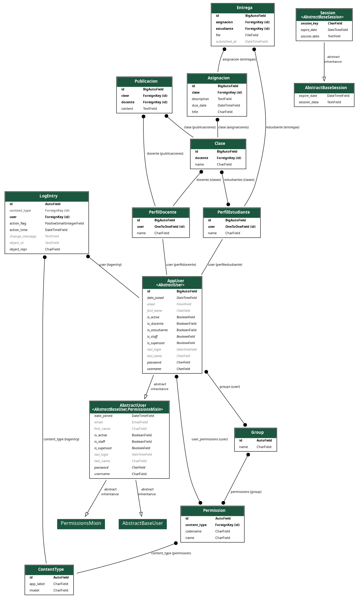

## Desplegando en la web

Para hacer el despliegue del proyecto se dividieron los servicios por dos lados.

El front estaría desplegado en `vercel`, como un servicio estático, aprovechando el empaquetamiento que nos hace vite con el comando

```bash
npm run build
```

El back está desplegado en `railway`, un servicio cloud que nos permite hostear proyectos en `django` de una manera fácil y rápida.

Al momento de llevar nuestro backend a producción, necesitamos sustituir `db.sqlite3` con una base de datos real, es asi que decidimos usar `postgresql`, servicio que podemos integrar en railway para tener nuestra base de datos guardada ahí.

**_Dashboard de railway_**

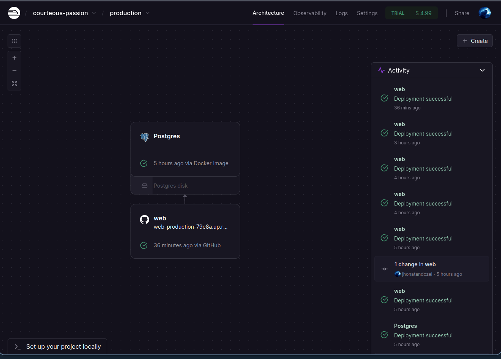

### Prueba

Para la prueba del backend se puede acceder a [https://web-production-79e8a.up.railway.app](https://web-production-79e8a.up.railway.app) y probar el inicio de sesión con estas credenciales:

```json
{
  "username": "frennow",
  "password": "coderdojo",
  "rol": "Docente"
}
```

Para probar puede rutear el endpoint `/api/loginUser`, o puede entrar directamente desde [este enlace](https://web-production-79e8a.up.railway.app/api/loginUser) deberia ver algo como:

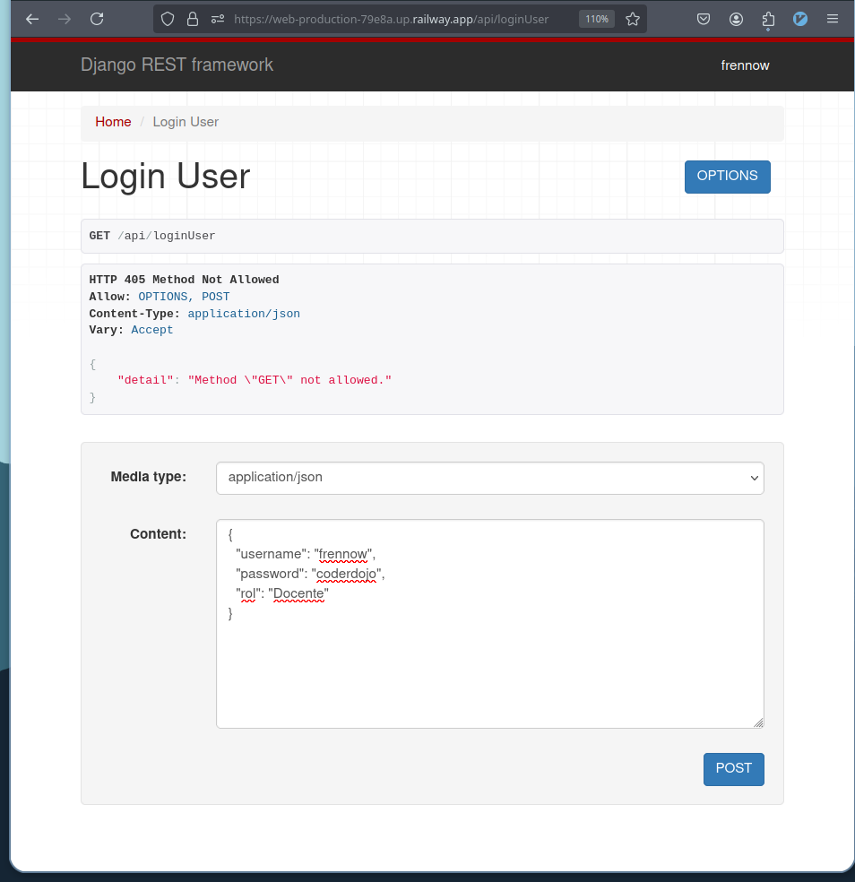

Haciendo click en `POST` debería darle un token a la sesión actual del navegador.

Para comprobar que está logueado puede entrar a `/api/` que direcciona a `/api/clase/1`, puede acceder mediante (este enlace)[https://web-production-79e8a.up.railway.app/api]
